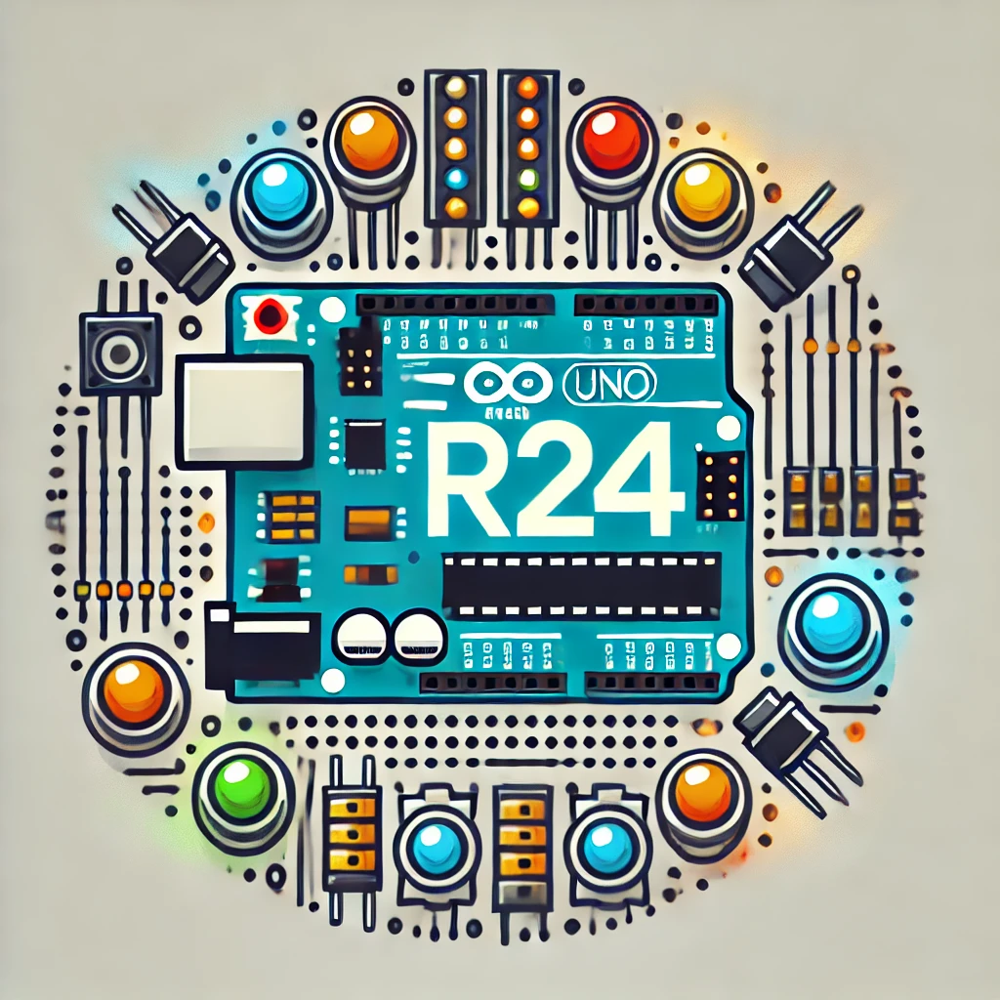

<!-- Improved compatibility of Takaisin alkuun link: See: https://github.com/othneildrew/Best-README-Template/pull/73 -->

<!--
*** Thanks for checking out the Best-README-Template. If you have a suggestion
*** that would make this better, please fork the repo and create a pull request
*** or simply open an issue with the tag "enhancement".
*** Don't forget to give the project a star!
*** Thanks again! Now go create something AMAZING! :D
-->

<!-- PROJECT SHIELDS -->
<!--
*** I'm using markdown "reference style" links for readability.
*** Reference links are enclosed in brackets [ ] instead of parentheses ( ).
*** See the bottom of this document for the declaration of the reference variables
*** for contributors-url, forks-url, etc. This is an optional, concise syntax you may use.
*** https://www.markdownguide.org/basic-syntax/#reference-style-links
-->
[![Contributors][contributors-shield]][contributors-url]
[![Forks][forks-shield]][forks-url]
[![Stargazers][stars-shield]][stars-url]
[![Issues][issues-shield]][issues-url]
[![GUI License][license-shield]][license-url]

<!-- PROJECT LOGO -->
 

  

  <h3 align="center">Speden Spelit: Arduino UNO</h3>

  

   **Speden Spelit** - Nopeus muistipeli, jossa pelaaja painaa painikkeita, sitä mukaan kun painiketta vastaava ledi syttyy. Peli nopeutuu sitä, mukaan kun pelaaja painaa oikeita painikkeita oikean aikaan. 

<!-- TABLE OF CONTENTS -->

  
Sisällysluettelo

  <ol>
    <li>
      <a href="#tietoa-projektista">Tietoa projektista</a>
      <ul>
        <li><a href="#Rakennettu-käyttäen">Rakennettu käyttäen</a></li>
      </ul>
    </li>
    <li>
      <a href="#näin-pääset-alkuun">Näin pääset alkuun</a>
      <a href="#vuokaavio">Vuokaavio</a>
      <a href="#kytkentä">Kytkentäkaavio</a>
    </li>
    <li><a href="#käyttö">Käyttö</a></li>
    <li><a href="#jatkokehitys">Jatkokehitys</a></li>
    <li><a href="#osallistujat">Osallistujat</a></li>
    <li><a href="#lisenssi">Lisenssi</a></li>
    <li><a href="#kiitokset">Kiitokset</a></li>
  </ol>

<!-- ABOUT THE PROJECT -->
## Tietoa projektista

[![SpedenSpell][product-screenshot]](https://example.com)

Tämä projekti on osa Oulun ammattikorkeakoulun "Tietotekniikan sovellusprojekti" -kurssia. **Speden Spelit** on fyysinen muistipeli ja nopeuspeli, jossa pelaajan tulee painaa oikeita nappeja syttyvien LED-valojen mukaisessa järjestyksessä. Peli vaikeutuu jokaisen viiden pisteen jälkeen nopeuttamalla valojen syttymisrytmiä.

Peli alkaa, kun käyttäjä painaa mitä tahansa painiketta tai jos laite kytketään virtoihin syttyy kaikki ledit, sekä 7-segmentissä alkaaa 5 sekunnin ajatus, joka kertoo käyttäjälle, että peli alkaa 5 sekunnin kuluttua.
Aluksi syttyy yksi LED-valo, jonka jälkeen pelaajan tulee painaa sitä vastaavaa nappia. Jokaisen oikean painalluksen myötä LEDien syttymisnopeus kasvaa ja painalluksen odotusaika lyhenee. Jos pelaaja painaa väärää nappia tai ei paina mitään nappia annetussa ajassa, peli päättyy.

Jos laitetta ei käytetä yli minuuttiin, peli siirtyy virransäästötilaan, jolloin 7-segmenttinäytöt sammuvat. Tämän jälkeen joka viides sekunti yksi LED-valo vilkkuu satunnaisessa järjestyksessä. Peli poistuu virransäästötilasta, kun mitä tahansa painiketta painetaan.

Peli tallentaa suurimman saavutetun pistemäärän (High Score), joka näytetään 7-segmenttinäytöillä pelin lopussa sekä ennen pelin alkua. High Score tallentuu Arduino Unon EEPROM-muistiin, jolloin se säilyy tallessa, vaikka laitteesta katkaistaisiin virta.

High Scoren voi nollata painamalla kahta painiketta samanaikaisesti ja pitämällä niitä pohjassa kaksi sekuntia.

Pelissä on myös debug-tila, joka aktivoidaan Spedenspelit.ino-tiedostosta asettamalla debug-arvoksi 1. Kun debug-tila on päällä, sarjaportti (Serial) aktivoituu, ja sarjamonitorista voi seurata pelin tapahtumia: miten painikkeet, LEDit ja segmenttinäytöt alustetaan ja toimivat, sekä jokaisen pelivaiheen ja tilan tiedot, mukaan lukien painallukset ja pisteiden kirjautuminen.

(<a href="#readme-top">Takaisin alkuun</a>)

### Rakennettu käyttäen

- Arduino UNO <a href="https://docs.arduino.cc/resources/datasheets/A000066-datasheet.pdf"> Arduino Uno Datasheet</a>
- 4x Lediä <a title="LED">💡</a>
- 4x painiketta <a title="button">📥 📤</a>
- 2x 7-segmenttinäyttöä  SC52-11SRWA📺 <a href="https://www.farnell.com/datasheets/2047571.pdf?_gl=1*10oxlmm*_gcl_au*OTI1ODYwNzgzLjE3MjgzMzExODQ."> SC52-11SRWA Datasheet</a>
- 2x 74HC595 serial-to-parallel muuntimia <a href="https://www.diodes.com/assets/Datasheets/74HC595.pdf"> 74HC595 Datasheet</a>

(<a href="#readme-top">Takaisin alkuun</a>)

<!-- GETTING STARTED -->
## Näin pääset alkuun
- Varmista, että sinulla on asennettuna Aruino IDE.
- Suorita kytkennät kytkentäkaavion avulla. 
- Laitaa lähdekoodi repositorysta. 
- Avaa lähdekoodi kansiosta Kooditoteutus/SpedenSpelit Arduino IDE:ssä
- Kytke Arduino Uno Usb-kaapelilla tietokoneen USB-portiin
- Paina Verify
- Paina Upload

-Jos kytkentäsi poikkeaa kytkentäkaaviosta, huomioi kytkentä pinnit.

(<a href="#readme-top">Takaisin alkuun</a>)

<!-- USAGE EXAMPLES -->
## Käyttö

Tähän tulee esimerkit Käyttötarkoituksista ja olosuihteista. 

(<a href="#readme-top">Takaisin alkuun</a>)

## Vuokaavio

(<a href="#readme-top">Takaisin alkuun</a>)

## Kytkentä

(<a href="#readme-top">Takaisin alkuun</a>)

<!-- ROADMAP -->

## Jatkokehitys

- [x] Debug
- [x] Virransäästö
- [ ] Äänet
- [ ] Highscoren tallennus verkkosivuille
- [ ] 7-Segmentti näyttöjen korvaus LCD-näytöllä
    - [ ] Ensimmäisen käynistyksen asennusvalikko LCD-näytöllä, kielivalikko, asetukset.
    - [ ] monikielisyys

(<a href="#readme-top">Takaisin alkuun</a>)

## Top contributors:

 <table>
  <tr>
    <td align="center"><a href="https://github.com/AleksandrCGM"> <b>Aleksandr Starchenkov</b></a> <a title="Code">💻</a></td>
    <td align="center"><a href="https://github.com/Dmitrytroshkov"> <b>Dmitry Troshkov</b></a> <a title="Code">💻</a></td>
    <td align="center"><a href="https://github.com/AlexeySheykin"> <b>Alexey Sheykin</b></a> <a title="Code">💻</a></td>
    <td align="center"><a href="https://github.com/vem882"> <b>Martin Negin</b></a> <a title="Code">💻</a></td>
  </tr>
</table>

(<a href="#readme-top">Takaisin alkuun</a>)

<!-- LICENSE -->
## LicenLisenssise

Projekti lisensoitu GNU General Public License v3.0 - lisenssillä Lue lisää  `LICENSE.txt`.

(<a href="#readme-top">Takaisin alkuun</a>)

<!-- ACKNOWLEDGMENTS -->
## Kiitokset

Kiitokset ja lähteet: 

* [GitHub Emoji Cheat Sheet](https://www.webpagefx.com/tools/emoji-cheat-sheet)
* [Malven's Flexbox Cheatsheet](https://flexbox.malven.co/)
* [Malven's Grid Cheatsheet](https://grid.malven.co/)
* [Img Shields](https://shields.io)
* [GitHub Pages](https://pages.github.com)
* [Font Awesome](https://fontawesome.com)
* [React Icons](https://react-icons.github.io/react-icons/search)
* [Best-README-Template](https://github.com/othneildrew/Best-README-Template)
* [Arduino UNO R3](https://docs.arduino.cc/hardware/uno-rev3/)
* [A guide to EEPROM](https://docs.arduino.cc/learn/programming/eeprom-guide/)
* [Arduino Button Mouse Control](https://docs.arduino.cc/built-in-examples/usb/ButtonMouseControl/)
* [Serial to Parallel Shifting-Out with a 74HC595](https://docs.arduino.cc/tutorials/communication/guide-to-shift-out/)
* [Arduino Language Reference](https://docs.arduino.cc/language-reference/)

(<a href="#readme-top">Takaisin alkuun</a>)

<!-- MARKDOWN LINKS & IMAGES -->
<!-- https://www.markdownguide.org/basic-syntax/#reference-style-links -->
[contributors-shield]: https://img.shields.io/github/contributors/vem882/r24_speede.svg?style=for-the-badge
[contributors-url]: https://github.com/vem882/r24_speede/graphs/contributors
[forks-shield]: https://img.shields.io/github/forks/vem882/r24_speede.svg?style=for-the-badge
[forks-url]: https://github.com/vem882/r24_speede/network/members
[stars-shield]: https://img.shields.io/github/stars/vem882/r24_speede.svg?style=for-the-badge
[stars-url]: https://github.com/vem882/r24_speede/stargazers
[issues-shield]: https://img.shields.io/github/issues/vem882/r24_speede.svg?style=for-the-badge
[issues-url]: https://github.com/vem882/r24_speede/issues
[license-shield]: https://img.shields.io/github/license/vem882/r24_speede.svg?style=for-the-badge
[license-url]: https://github.com/vem882/r24_speede/blob/master/LICENSE.txt
[product-screenshot]: images/logo.webp